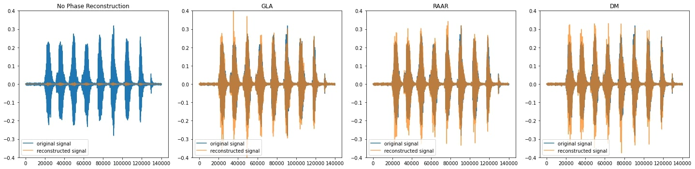

## Phase Retrieval Algorithms
---
- GLA(Griffin Lim Algorithm)
- RAAR(Relaxed Averaged Alternating Reflections)
- DM(Difference Map)

### Examples

 

> **Reference**\
> [1] T. Peer, S. Welker, and T. Gerkmann, “Beyond Griffin-Lim: Improved Iterative Phase Retrieval for Speech,” in Int. Workshop on Acoustic Signal Enhancement (IWAENC), Sep. 2022.
